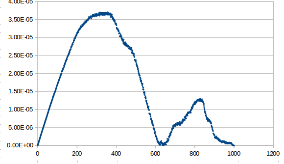
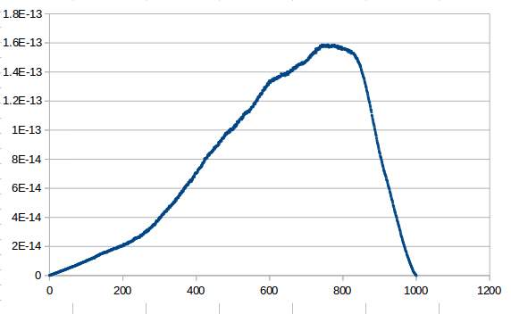
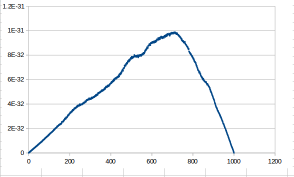

# Finite difference method

###Prerequisites

Installed `ifort` compiler

### Compilation

To build siply use `make` in the project main directory.

### KIND

To select `KIND` value for floating point variables modify variable `K`

```
make K=8
```

### Running

```
./main n
```
where n is grid size.

##Charts

Each point is represents difference between calculated value and expected value.

###KIND=4


###KIND=8


###KIND=16

